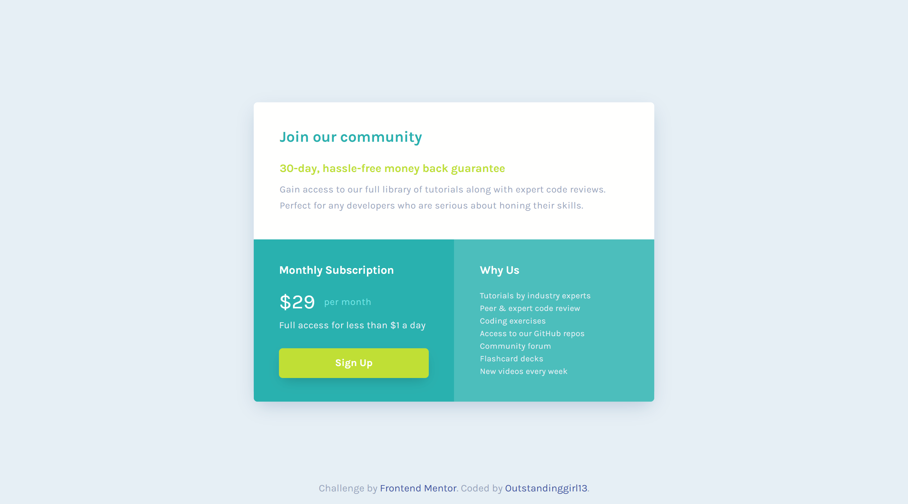

# Frontend Mentor - Single price grid component solution

This is a solution to the [Single price grid component challenge on Frontend Mentor](https://www.frontendmentor.io/challenges/single-price-grid-component-5ce41129d0ff452fec5abbbc). Frontend Mentor challenges help you improve your coding skills by building realistic projects. 

## Table of contents

- [Overview](#overview)
  - [The challenge](#the-challenge)
  - [Screenshot](#screenshot)
  - [Links](#links)
- [My process](#my-process)
  - [Built with](#built-with)
  - [What I learned](#what-i-learned)
  - [Useful resources](#useful-resources)
- [Author](#author)

## Overview

### The challenge

Users should be able to:

- View the optimal layout for the component depending on their device's screen size
- See a hover state on desktop for the Sign Up call-to-action

### Screenshot



### Links

- Solution URL: [Single Price Grid Component – Clean and Responsive Layout](https://www.frontendmentor.io/solutions/single-price-grid-component-clean-and-responsive-layout-cE0ouKxCkO)
- Live Site URL: [GitHub Pages](https://outstandinggirl13.github.io/single-price-grid-component-master/)

## My process

### Built with

- Semantic HTML5 markup
- CSS custom properties
- Flexbox
- CSS Grid
- Mobile-first workflow

### What I learned

1. I centered the entire card using CSS Grid instead of Flexbox this time.
```CSS
.main {
  display: grid;
  place-items: center;
  min-height: 100vh;
}
```
This short and clean approach perfectly centers the component both horizontally and vertically.

2. For the mobile layout, I used the following rule:

```CSS
.main__card {
  display: grid;
  grid-template-columns: repeat(auto-fit, minmax(310px, 1fr));
  width: fit-content;
}
```

This means: “Create as many flexible columns as will fit in one row, where each column is at least 310px wide and stretches to share leftover space equally.”
It was a great way to make the card responsive without adding extra media queries.

3. I also used grid-template-areas for the first time, which helped me organize the layout more visually:

```CSS
.main__card {
  grid-template-areas:
    "box-1 box-1"
    "box-2 box-3";
}

.join {
  grid-area: box-1;
}

.subscription {
  grid-area: box-2;
}

.why-us {
  grid-area: box-3;
}
```

Using named grid areas made the structure much easier to understand and adjust later.

### Useful resources

- [CSS Flexbox vs Grid - Are you using them right?](https://www.youtube.com/watch?v=aEj6k-gi9-s) – This video gave me a clear and beginner-friendly explanation of how CSS Grid works, which helped me understand concepts like grid-template-columns, auto-fit, and minmax().
- [CSS Grid Course - The Only Grid Tutorial You'll Ever Need!](https://www.youtube.com/watch?v=JYfiaSKeYhE) – This tutorial showed practical ways to build responsive grid layouts.

## Author

- Website - [Outstandinggirl13](https://github.com/Outstandinggirl13)
- Frontend Mentor - [@Outstandinggirl13](https://www.frontendmentor.io/profile/Outstandinggirl13)
